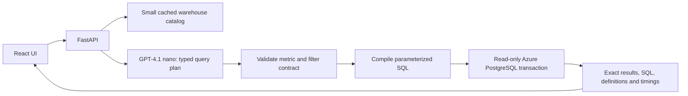

# Talk to the Olist warehouse

A minimal React + TypeScript frontend and FastAPI backend for the existing Azure PostgreSQL warehouse `olist_olap_abd`. Uses **GPT-4.1 nano through OpenRouter**, with **`OPENROUTER_API_KEY`**. Direct OpenAI (`OPEN_AI_API_KEY`) and Azure OpenAI adapters remain available. No warehouse reset, reload, or schema migration is performed at startup.

## Run locally

Requires Python 3.11–3.13, [uv](https://docs.astral.sh/uv/), Node.js 22+, and network access to the existing Azure PostgreSQL server and OpenRouter API.

1. Keep your existing root `.env`. For a new checkout, copy `.env.example` to `.env` and fill in its values. The application uses `PGHOST`, `PGPORT`, `PGUSER`, `PGPASSWORD`, `PGSSLMODE` and `OPENROUTER_API_KEY`; `PGDATABASE` defaults to `olist_olap_abd`. Set `OPENAI_PROVIDER=openrouter` and `OPENAI_MODEL=openai/gpt-4.1-nano` (also the defaults). An OpenRouter key will not authenticate with the direct OpenAI endpoint. Restart the backend after changing `.env`. Lines 2–5 of `scripts/az/az_reset_olap.txt` are connection references only. **Do not execute that file to launch the app.**
2. From the repository root, start the backend:

   ```powershell
   uv sync --frozen --extra dev
   uv run python -m app
   ```

3. In another terminal, start the UI:

   ```powershell
   cd frontend
   npm ci
   npm run dev
   ```

4. Open **http://127.0.0.1:5173**. API health: **http://127.0.0.1:8000/api/health**. The health endpoint checks process/configuration only; `/api/warehouse` verifies live connectivity independently of the model key. Local API documentation: `/api/docs`; machine-readable schema: `/api/openapi.json`.

For a single process, run `npm run build` in `frontend`, then start the backend and open **http://127.0.0.1:8000**. The backend automatically serves the built UI. Alternatively, `docker compose up --build` builds and runs the same app on localhost:8000. Docker needs to be running; no local PostgreSQL container is required.

## What you can ask

- “What is our total revenue and order count?”
- “Which 5 categories generate the most revenue?”
- “Show monthly revenue for 2018.”
- “Which customer states have the most orders?”
- Follow up with “Only delivered orders” or “Now group by category.”

Metrics: merchandise revenue, distinct orders, item count, freight, item value including freight, average merchandise value per order. Group by year, quarter, month, category, customer/seller state, or status. Filter by purchase date range, category, state, and status. Maximum two grouping dimensions, four metrics, and 100 result rows. Missing groups are not automatically filled with zeros. Questions outside this contract receive clarification; extending the contract requires a reviewed metric definition and evaluation case.

Revenue excludes freight and includes all statuses by default. Orders without items do not appear in this fact table. An order spanning categories can be counted in multiple groups. Profit, reviews, payment analysis, delivery times, forecasting, arbitrary SQL, raw records, and cross-period derived calculations are outside this first version.

## Design



The model does not write executable SQL. The backend owns every expression, table, join, and sort identifier. Parameters carry filter values separately. Queries run in read-only transactions with statement/lock timeouts. A bounded pool and concurrency limit protect the database and model spend. Each DB operation is audited to `logs/db_operations.md` and structured stdout, without credentials, questions, filter values or result rows. Conversation context lives in browser memory and is limited to six turns. Reloading the page or starting a new conversation clears it.

Only questions, bounded prior plans and small warehouse metadata/category labels go through OpenRouter to the model provider. Actual result rows never go to the model. Answers and tables are generated from database values; there is no second model call to invent a numeric summary. OpenRouter requests require structured-output support and exclude providers that collect data (`require_parameters=true`, `data_collection=deny`). This does not itself guarantee zero retention at every layer; configure account logging and review provider policies for production. Category metadata has a 60-second TTL; **query results are not cached**. API keys are server-only and `.env` is excluded from Git and Docker context.

**Current data issue:** all 112,650 fact category keys are NULL, with no product-category fallback. Category questions are blocked with an explanation until the KNIME category mapping is repaired. Other validated relationships and total metrics remain available. The application does not alter ETL data to conceal this issue.

## Validation

```powershell
uv run pytest
uv run ruff check backend scripts/verify_warehouse.py scripts/evaluate_agent.py
cd frontend
npm run build
```

Optional live checks from the repository root (use configured services; the evaluation incurs model API usage):

```powershell
uv run python scripts/verify_warehouse.py
uv run python scripts/evaluate_agent.py
```

Browser regression tests require the built app running on port 8000 and Microsoft Edge:

```powershell
cd frontend
npm run test:e2e
```

The browser suite reads live warehouse metadata but uses explicit response fixtures for table/chart,
follow-up and error rendering. It is separate from the live model regression script; passing UI
fixtures does not demonstrate live model accuracy.

The verification checks warehouse counts, item grain, FK matches, smart date keys, totals, database capabilities, and a read-only query plan. The live evaluation covers common questions, unavailable data, injection attempts, and follow-ups. Reports go to ignored `artifacts/`; every DB transaction goes to the audit log. Source review deduplication (99,224 rows) is unchanged; this application never queries or loads OLTP reviews.

## Project map

- `backend/app/`: configuration, semantic catalog, plan model, SQL compiler, warehouse adapter, service and API.
- `backend/tests/`: compiler safety and API behavior regression tests (no external services).
- `frontend/src/`: conversation UI, result table/chart, accessible controls, API types.
- `docs/agent-decisions.md`: requested options/decision/scaling/tradeoffs table, with primary sources.
- `docs/cloud.md`: Azure migration and performance guidance; distinguishes implemented support from future provisioning.
- `sql/04_agent_reader_role.sql`: optional least-privilege role grants for an administrator; not executed automatically.

The existing connection may be an administrative ETL account. Read-only transactions protect this application path, but production must use a dedicated restricted login or managed identity. The local server binds to loopback; do not expose local auth mode to the internet. See the cloud guide for built-in Azure authentication, private access, and deployment settings.
